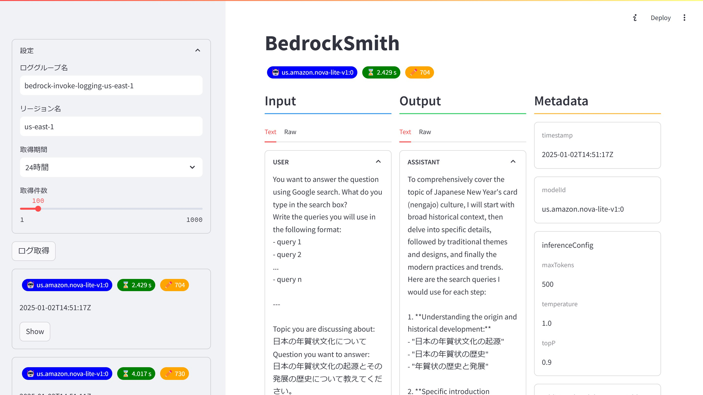
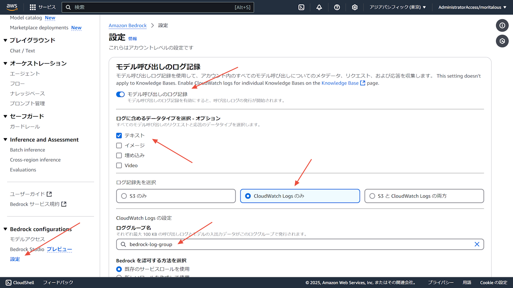

# BedrockSmith

CloudWatch Logsに出力したBedrockの呼び出しログを整形して表示します



## 前提条件

Bedrockの呼び出しログを有効化してください。



## 起動方法

[Streamlit](https://streamlit.io/)と[streamlit-extras](https://extras.streamlit.app/)を使用して構築しました。

ライブラリーをインストールします。

```shell
pip install -r requirements.txt
```

CloudWatchログのロググループ名とリージョンを`app.py`に記述します。デフォルト値は以下の値としています。UI上からも変更は可能です。

```python
default_log_group_name = "bedrock-invoke-logging-us-east-1"
default_region_name = "us-east-1"
```

Streamlitを起動します。

```shell
streamlit run app.py
```


## 使用方法

サイドバーの「設定」を変更し、「ログ取得」ボタンをクリックします。しばらくするとサイドバーに取得したログが表示され、先頭の1件がメインエリアに表示されます。各ログの「Show」をクリックすると、メインエリアが切り替わります。

メインエリアは、Input、Output、Metadataの3列構成です。InputとOutputはテキスト（Textタブ）とJSON表示（Rawタブ）の切り替えが可能です。

## 制限事項

ConverseとConverse Streamのみを対象としています。
あまりテストしていないのでエラーになったらごめんなさい。（プルリクお待ちしております。）
